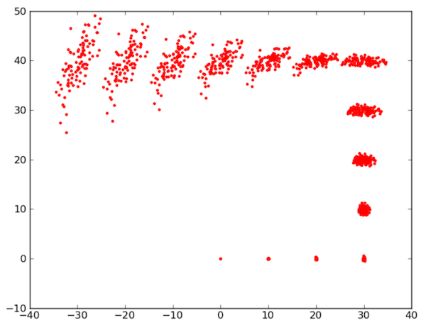

# Práctica 2 de Robots Móviles. Mapeado y localización

En esta práctica vamos a trabajar con varios algoritmos de localización y mapeado de robots móviles que iremos viendo en las sesiones teóricas.

La práctica tiene varias partes: para los requisitos mínimos no es necesario que escribáis código, solo que probéis las funcionalidades ya implementadas en ROS. Para la mayoría de las partes adicionales tendréis que escribir algo de código, en principio en Python aunque podríais hacerlo en otro lenguaje.

Para realizar los requisitos mínimos tendréis que consultar referencias adicionales, aquí no se va a explicar cómo crear mapas y localizarse en ROS ya que la idea es que consultéis la información vosotros mismos. En el [apéndice 1](#apendice_1) tenéis unas cuantas referencias, pero podéis buscar otras si lo deseáis


## Parte 1: Construcción de mapas del entorno (requisito mínimo)

En esta primera parte de la práctica nos centraremos en la generación de mapas 2D del entorno. Este mapa se utilizará posteriormente para la localización del robot. Utilizaremos los paquetes por defecto en ROS para mapeado. Se usa un filtro de partículas tipo "FastSLAM" o "Rao-Blackwellizado". Este algoritmo lo veremos en clase de teoría con posterioridad . No obstante no es necesario entender su funcionamiento para probarlo. 

El mapa lo va construyendo el robot a medida que se va moviendo. Para el manejo del robot se recomienda usar la teleoperación mediante teclado, ya que así podemos ir a la velocidad que nos parezca mejor y dirigirlo por donde queramos. Como es lógico el robot no puede mapear aquellas partes del entorno por donde no ha pasado, y el mapa saldrá peor si nos movemos más rápido.

Prueba el mapeado como mínimo en un par de entornos distintos (por ejemplo un edificio con habitaciones y un entorno abierto con varios obstáculos)

Pon en la documentación imágenes con los mapas obtenidos y contesta a estas preguntas: 

- ¿Qué resolución tienen los mapas obtenidos? (está en el fichero del mapa, busca en las referencias o en internet dónde aparece esa información)
- ¿Crees que hay cierto tipo de entornos en los que funciona mejor? (espacios abiertos, espacios pequeños, pasillos,...)
- construye el mapa variando los parámetros del algoritmo. Varía al menos `particles`, `linearUpdate` y `angularUpdate`. En el wiki de ROS tienes la [lista completa de parámetros](http://wiki.ros.org/gmapping#slam_gmapping) (sección 4.1.4). 

> En ROS muchos nodos tienen parámetros mediante los que podemos configurar su funcionamiento. El nodo encargado de crear el mapa por defecto es `slam_gmapping`. Para modificar un parámetro podemos hacerlo de varias formas, una de ellas es desde la terminal con `setparam`. Por ejemplo para modificar el parámetro `particles` del `slam_gmapping` y ponerlo a valor 5:
```bash
rosparam set /slam_gmapping/particles 5
```
> Para más información puedes consultar la [documentación de `rosparam`](http://wiki.ros.org/rosparam)

Para poder repetir la misma prueba variando los parámetros del algoritmo podéis grabar los datos de los sensores en un fichero  `rosbag`. Este `rosbag` se puede "reproducir" posteriormente las veces que haga falta como si fuera información que el robot está recibiendo "en vivo", pudiéndose así repetir un experimento varias veces con los mismos datos de entrada. Tenéis explicado el uso de `rosbag` en el [apéndice 2](#apendice_2)

> En `rosbag` si no quieres grabar todos los *topics* para ocupar menos espacio, asegúrate de grabar como mínimo el *topic* del laser (mira antes si es `/scan` o `/base_scan`) y además `/tf` (para que el algoritmo de mapeado pueda hacer la transformación de coordenadas) y también `/tf_static` si existe.

## Parte 2: Localización y navegación (requisito mínimo)

Una vez tenemos un mapa, lo podemos usar para localizar al robot (saber dónde está en todo momento) y para navegar por el entorno: ir del punto donde está el robot a un destino cualquiera, planificando la mejor trayectoria y sin chocar con obstáculos por el camino. En la barra de botones de la parte superior de `rviz` tenemos dos botones para esto:

- `2D pose estimate` nos permite marcar la posición (clic con el ratón) y la orientación (*arrastrar* el ratón) donde se encuentra ahora mismo el robot. Esto es necesario para poder inicializar el algoritmo de localización que es un filtro de partículas. Este algoritmo lo veremos en clase de teoría el día 3 de noviembre, aunque intuitivamente es fácil de entender, la nube de "flechitas" verdes representa las posiciones y orientaciones más plausibles para el robot en el instante actual, si el algoritmo funciona bien esta nube irá siguiendo la posición real del robot en todo momento, y cuanto mejor localizado esté el robot más "condensada" estará la nube.
- `2D Nav Goal`: para marcar el punto al que queremos que se mueva el robot. Primero tenemos que asegurarnos de que el robot está localizado (que la "nube" de flechitas verdes está en torno a la posición real. Si hay una trayectoria posible, aparecerá dibujada en rviz y el robot se irá moviendo por ella.

No obstante **estos botones no funcionarán si no está cargado en memoria el mapa y los nodos de ROS necesarios** para la planificación de trayectorias y evitación de obstáculos. Las instrucciones concretas para hacer esto dependen del robot y del simulador empleado, tendrás que buscarlas por Internet o consultar las referencias del [apéndice 1](#apendice_1)

Preguntas a contestar en este apartado:

- Investiga qué significa esa especie de "recuadro de colores" que aparece rodeando al robot cuando se pone a calcular la trayectoria y se va moviendo ¿qué significan los colores cálidos/frios?
- Investiga qué algoritmo usa ROS por defecto para calcular la trayectoria hasta el destino. Explica su funcionamiento lo más intuitivamente que puedas en aprox. 100-150 palabras (no el código línea por línea sino la idea de cómo funciona). ¿Lo has visto en el grado?
- Averigua cuáles son esos nodos que necesitamos cargar en memoria para que funcione la navegación, pon los nombres y describe brevemente el papel de cada uno en 1-2 frases.

## Parte 3: Modelo de error del movimiento basado en odometría (requisito adicional, hasta 1 punto)

> Para los requisitos adicionales (partes 3 y 4) se os da una plantilla hecha en Python para que os sirva como base. Podéis no usarla e implementarla en el lenguaje que queráis pero tendréis que apañároslas para conseguir un resultado similar (podéis crear los gráficos con Matlab o como queráis siempre que los datos hayan sido generados por vuestro código).

Implementa el **modelo de error basado en la odometría del robot y que usa muestras**, que hemos visto en la clase de teoría el 20 de octubre. El programa dibujará por pantalla la posición de las muestras en cada paso para una secuencia de movimientos del robot dada por las posiciones medidas por la odometría. El resultado será algo similar a esto:

 

Para llevar a cabo la implementación podeis utilizar [la plantilla](recursos_prac2/plantilla_practica2.zip) que os proporcionamos. Verás que es un .zip con código Python para que te sirva como punto de partida, y un fichero `.txt` cuyo uso veremos luego. 

En el código la clase `Pose` representa una posible posición del robot (\\(x,y,\theta)\\).

Para llevar a cabo el modelado del error tendrás que implementar las dos funciones principales: `sample_normal_distribution` y `sample_motion_model`

- En la función `sample_normal_distribution(b)` debes devolver una muestra de una distribución normal de media 0 y desviación típica `b`. 

> OJO: Para generar valores de la distribución debes usar el método de cálculo de la normal que vimos en clase, el objetivo es ver que funciona. No uses `numpy.random.normal` o funciones similares ya hechas. Tendrás 0.2 puntos extra si lo demuestras gráficamente (sacando N muestras de `sample_normal_distribution`, representándolas en una gráfica y incluyendo en la memoria la gráfica y el código python usado para generarla)

- En la función `sample_motion_model` debes implementar el algoritmo del mismo nombre que vimos en teoría (transparencia 23 del tema 3 parte II). Cuidado, a diferencia del algoritmo de teoría, que tiene como entrada \\(\delta_{rot1}, \delta_{rot2}, \delta_{trans}\\) la función Python recibe la `Pose` medida por la odometría en el instante actual y en el previo. A partir de estas dos `Pose`s puedes calcular los  \\(\delta\\)  (cómo calcularlos está en la transparencia 11, "Convertimos la odometría en relativa" del tema 3 parte II).

El programa recibe dos parámetros en línea de comandos:

1. Fichero de odometría: En la plantilla es el fichero `odometria.txt`. Ese fichero contiene las posiciones medidas por la odometría del robot. Cada línea tiene tres números \\( x,y,  \theta\\). Ya se os da implementado código Python que lee estos datos y los coloca en un array de objetos `Pose`
2. Número de muestras

Un ejemplo de ejecución del programa sería el siguiente:

```bash
python practica1.py odometria.txt 500
```

En el código debes ajustar los cuatro parámetros de error que vimos en clase de teoría, \\( \alpha_1, \alpha_2, \alpha_3, \alpha_4\\). Prueba el algoritmo utilizando distintas secuencias de odometría y distintos parámetros de error. Incorpora a la memoria las gráficas generadas y comenta brevemente el resultado obtenido para cada una de las secuencias.

## Parte 4: Modelo de error del sensor (requisito adicional, hasta 1 punto)

Implementa el **modelo del sensor para un sensor basado en landmarks** como el que se ha visto en clase del 20 de octubre, que detecte la distancia y orientación a un landmark. Supondremos resuelto el problema de la asociación de datos. Tendrás que implementar otro fichero .py con una función `sensor_model` de este estilo (toma la clase `Pose` de la plantilla de la sección anterior):

```python
def sensor_model(pose_robot, pose_landmark, d, alfa):
    """Devuelve la probabilidad de una medida del sensor, dada
    una pose del robot, la del landmark en el mapa, la distancia
    medida y el ángulo medido
    Argumentos:
      pose_robot (Pose): posición actual del robot
      pose_landmark (Pose): posición en el mapa del landmark detectado
      d (float): distancia devuelta por el sensor
      alfa (float): ángulo devuelto por el sensor
    Devuelve
      float: cantidad proporcional a la probabilidad de la medida
    """
    #TODO: falta implementar la función
    return 0
```
Para probarlo haz un programa al que se le pueda pasar argumentos en línea de comandos con la pose del robot, del landmark, la distancia medida y el ángulo medido (ángulos en grados para que sea más intuitivo) e imprima en la consola la probabilidad (como hemos visto en clase en realidad no será una probabilidad sino una cantidad proporcional a la verdadera probabilidad).

## Entrega de la práctica

### Baremo

> Como su nombre indica **los requisitos mínimos deben realizarse obligatoriamente para poder aprobar la práctica**. Del resto de requisitos podéis elegir los que queráis. Tened en cuenta que todos los puntos que se proponen suman más de 10 por lo que no es necesario que los hagáis todos, ya que **en cada práctica no os puedo poner una nota superior al 10**.

- **Requisitos mínimos (hasta un 6)**: realización de las partes 1 y 2 de la práctica en el simulador que queráis. La práctica debe estar adecuadamente documentada, respondiendo como mínimo a las preguntas que se plantean y detallando los resultados de todos los experimentos realizados. 
- **(hasta 2 puntos adicionales)**: realización de las partes 3 y 4 de la práctica.
- **(hasta 2 puntos adicionales)**: implementar un algoritmo de localización con filtro de partículas usando las partes 3 y 4 de la práctica. Además de estas partes necesitaréis implementar el algoritmo en sí y un pequeño simulador que simule un robot  moviéndose por un entorno 2D en el que hay landmarks de los que puede detectar distancia y orientación. En cada momento se debe mostrar la diferencia entre la posición simulada y la obtenida por el filtro de partículas. No es necesario que el simulador sea gráfico, podría imprimir simplemente los datos numéricos en la consola.
- **(hasta 1 punto adicional)** tomar alguna implementación ya existente en internet de un algoritmo de localización o mapeado (sea o no de ROS) y detallar cómo funciona el algoritmo y los resultados en las pruebas que  hayáis realizado. Redactadlo en forma de tutorial para que pueda servir a otros compañeros que quieran probar la implementación y saber cómo funciona.
- Cualquier otra idea que se os ocurra relacionada con el mapeado y la localización. Consultad con el profesor para ver cuánto se podría valorar en el baremo.

### Formato de la documentación

La documentación en un formato portable y multiplataforma como PDF o HTML. Se recomienda incluir videos capturados del simulador o del robot real o los ficheros rosbag de los experimentos.

### Plazos y procedimiento de entrega

La práctica se podrá entregar hasta las 23:59 horas del **martes 16 de Noviembre del 2021**.

La entrega se realizará a través del Moodle de la asignatura.

## <a name="apendice_1">Apéndice 1: Referencias</a>

Para realizar los requisitos mínimos necesitaréis consultar información adicional sobre localización y mapeado en ROS, ya que en clase de prácticas no vamos a explicar las instrucciones exactas para realizarlo. No tenéis por qué seguir exactamente estas referencias que ponemos aquì, podéis usar cualquier otra si os gusta más.

> Como recomendación general, fijaos en que la biblioteca de la UA tiene disponibles muchos [libros en formato electrónico](https://ua.on.worldcat.org/search?databaseList=1953%2C1931%2C1875%2C1941%2C2259%2C2237%2C3313%2C2375%2C239%2C2570%2C638%2C2260&queryString=ros+robots&clusterResults=true) sobre ROS.

### Turtlebot 2

Si tenéis instalado el soporte de Turtlebot 2 podéis consultar estas referencias. Recordad que los ordenadores de laboratorio tienen este soporte instalado.

> Los ficheros de configuración de Stage para Turtlebot 2 que están preparados para mapeado y navegación usan en lugar de un laser una kinect simulada, con un campo de visión muy reducido. En el moodle tienes los ficheros modificados para ampliar el campo de visión al que tienen los turtlebot reales, usa estos, los mapas deberían salir mucho mejor.

- Para mapeado y localización/navegación en **Stage** los capítulos 9 y 10 respectivamente del libro *"Programming Robots with ROS"*, de Quigley, Gerkey y Smart, ed. O'Reilly, 2015. El capítulo 9 os puede servir entero y el 10 hasta la sección "Navigating in code", no incluído. Podéis [consultarlo *online*](https://linker2.worldcat.org/?jHome=https%3A%2F%2Fbua.idm.oclc.org%2Flogin%3Furl%3Dhttps%3A%2F%2Flearning.oreilly.com%2Flibrary%2Fview%2F%7E%2F9781449325480%2F%3Far&linktype=best) por medio de la biblioteca de la UA. 
- Para **Gazebo** podéis seguir por ejemplo [este tutorial online](https://learn.turtlebot.com/2015/02/03/8/).

### Turtlebot 3

La empresa Robotis, fabricante de los servos que llevan los Turtlebot 3 tiene un manual bastante completo *online* con una sección para [SLAM simulado](https://emanual.robotis.com/docs/en/platform/turtlebot3/slam_simulation/) y otra para [navegación](https://emanual.robotis.com/docs/en/platform/turtlebot3/nav_simulation/) (aseguráos de seleccionar la versión "Noetic" en la barra superior)

En el libro "ROS robot programming", que está escrito por los desarrolladores del Turtlebot 3 y está [disponible en Internet de manera gratuita](https://community.robotsource.org/t/download-the-ros-robot-programming-book-for-free/51) puedes encontrar más información en el capítulo 11. Aunque aquí lo hace con un turtlebot de verdad, para hacerlo en simulación básicamente se trata de sustituir el comando `roslaunch turtlebot3_bringup turtlebot3_robot.launch`, que arranca el robot real por `roslaunch turtlebot3_gazebo turtlebot3_world.launch`que arranca la simulación.

## <a name="apendice_2">Apéndice 2: uso de `rosbag`</a>

El paquete `rosbag` es un conjunto de herramientas para grabar y reproducir topics en ROS. Proporciona una herramienta de línea de comandos llamada `rosbag` para trabajar con *bags*, así como APIs de código para leer/escribir estas grabaciones en C++ y Python.

A continuación se muestra la lista de operaciones soportadas por el comando `rosbag`:

- record: Graba en un fichero bag el contenido de los topics especificados.
- info: Muestra un resumen del contenido de un fichero bag. 
- play: Reproduce el contenido de uno o más ficheros bag.
- check: Comprueba si el fichero bag es reproducible en el sistema actual o si puede ser migrado a otro sistema.
- fix: Repara los mensajes en un fichero bag de forma que se pueda repro- ducir en el sistema actual.
- filter: Convierte un fichero bag utilizando expresiones de Python. compress: Comprime uno o más ficheros bag.
- decompress: Descomprime uno o más ficheros bag.
- reindex: Reindexa uno o más ficheros bag que esten corruptos.

### Grabación de datos

Esta sección muestra como grabar datos de los *topics*. Todos los datos de los *topics* que grabemos se acumularán en un fichero bag.

Veamos un ejemplo usando el paquete  `turtlesim` que nos permite controlar una especie de "tortuga" en pantalla. Ejecutaremos los siguientes comandos en distintas terminales:

```bash
roscore
rosrun turtlesim turtlesim_node
rosrun turtlesim turtle_teleop_key
```

Esto iniciará dos nodos - el nodo visualizador y un nodo que permite el control por teclado del robot usando las teclas de flechas en el teclado. Si seleccionas la ventana de terminal desde la que lanzó turtle_keyboard, deberías ver algo como lo siguiente:

```bash
 Reading from keyboard
---------------------------
Use arrow keys to move the turtle.
```

Presionando las flechas del teclado el robot turtlebot se moverá por la panta- lla. Ten en cuenta que para mover el robot debes tener seleccionada la terminal desde la que lanzaste a Turtlesim y no la ventana de Turtlesim.
En caso de que ya tuvieses el robot real funcionando u estuvieses utilizando otros nodos que publican datos no es necesario la ejecución de los comandos anteriores.

### Grabación de todos los topics

Primero vamos a examinar la lista completa de topics que están siendo pu- blicados en el sistema en ejecución. Para ello, abre un nuevo terminal y ejecuta el comando:

```bash
rostopic list -v
```

si has ejecutado el Turtlesim anteriormente deberías ver la siguiente salida por pantalla:

```bash
Published topics:
* /turtle1/color_sensor [turtlesim/Color] 1 publisher
* /turtle1/cmd_vel [geometry_msgs/Twist] 1 publisher
* /rosout [rosgraph_msgs/Log] 2 publishers
* /rosout_agg [rosgraph_msgs/Log] 1 publisher
* /turtle1/pose [turtlesim/Pose] 1 publisher
Subscribed topics:
* /turtle1/cmd_vel [geometry_msgs/Twist] 1 subscriber
* /rosout [rosgraph_msgs/Log] 1 subscriber
```

La lista de topics publicados es el único tipo de mensaje que podría grabarse en el archivo de registro de datos, ya que sólo se graban los mensajes publicados. El tema /turtle1/cmd_vel es el mensaje de comando publicado por teleop_turtle que es tomado como entrada por el proceso turtlesim. Los mensajes /turtle1/color_sensor y /turtle1/pose son mensajes de salida publicados por turtlesim.

Ahora grabaremos los datos publicados. Abre una nueva ventana de terminal. En esta ventana ejecuta los siguientes comandos

```bash
mkdir bagfiles
cd bagfiles
rosbag record -a
```
con estas intrucciones estamos creando un directorio temporal para grabar los datos y luego ejecutando el comando `rosbag` con la opción `-a`, indicando que todos los temas publicados deben ser acumulados en un archivo bag.

Vuelve a la ventana del terminal con `turtle_teleop` y mueve el robot durante unos 10 segundos. En la ventana que ejecuta `rosbag record` pulsa Ctrl-C para terminar la grabación. Ahora examina el contenido del directorio `bagfiles`. Deberías ver un archivo con un nombre que comience con el año, la fecha, la hora y el sufijo `.bag`. Este es el archivo que contiene todos los datos publicados por cualquier nodo en el momento en que se estaba ejecutando el comando `rosbag record`.

### Grabar solo algunos *topics*

Dado que pueden haber muchos topics publicando información, puede desearse grabar solo cierta información publicada por algunos topics. Por ello es posible especificar al comando `rosbag record` los topics en particular que se desean grabar.

```bash
rosbag record -O subset /turtle1/cmd_vel /turtle1/pose
```

El argumento `-O` le dice al comando `rosbag` que se grabe en un archivo llamado `subset.bag`, y los argumentos del comando hacen que sólo se suscriba a estos dos temas. Mueva el robot en el simulador durante varios segundos usando los comandos de flecha del teclado, y luego pulsa Ctrl-C para terminar la grabación.

### Examinando ficheros bag

Ahora que sabemos como grabar un archivo *bag* po demos examinarlo y reproducirlo usando los comandos `rosbag info` y `rosbag play`. Primero vamos a ver lo que está registrado en el archivo *bag*. 

Podemos ejecutar el comando `rosbag info` – este comando comprueba el contenido del archivo bag sin reproducirlo. Ejecuta el siguiente comando desde el directorio *bagfiles*:

```bash
rosbag info <your bagfile>
```

Deberías ver algo como lo siguiente:

```bash
path: 2014-12-10-20-08-34.bag
version: 2.0
duration: 1:38s (98s)
start: Dec 10 2014 20:08:35.83 (1418270915.83)
end: Dec 10 2014 20:10:14.38 (1418271014.38)
size: 865.0 KB
messages: 12471
compression: none [1/1 chunks]
types:       geometry_msgs/Twist [9f195f881246fdfa2798d1d3eebca84a]
rosgraph_msgs/Log [acffd30cd6b6de30f120938c17c593fb]
turtlesim/Color [353891e354491c51aabe32df673fb446]
turtlesim/Pose [863b248d5016ca62ea2e895ae5265cf9]
topics: /rosout  4 msgs : rosgraph_msgs/Log   (2 connections)
/turtle1/cmd_vel      169 msgs  : geometry_msgs/Twist
/turtle1/color_sensor 6149 msgs : turtlesim/Color
/turtle1/pose         6149 msgs : turtlesim/Pose
```
Esto nos indica los nombres y tipos de *topics*, así como el número de mensajes de cada topic contenidos en el archivo bag. Podemos ver que de los temas que se anunciaron que vimos en la salida del rostopic, cuatro de los cinco fueron publicados realmente sobre nuestro intervalo de grabación. Mientras corríamos el comando `rosbag` con el parámetro `-a`, grababa todos los mensajes publicados por todos los nodos.

### Reproduciendo ficheros bag

Al reproducir un fichero bag se están volviendo a enviar los mismos mensajes que en la situación original, podemos emplear esta funcionalidad para ejecutar pruebas siempre con la misma secuencia de datos de entrada.

Primero mata el programa de teleoperación que puede estar todavía ejecutándose desde la sección anterior - Ctrl-C en la terminal donde iniciaste `turtle_teleop_key`. Deja a Turtlesim corriendo. En una ventana de terminal ejecuta el siguiente comando en el directorio donde grabaste el archivo bag original:

```bash
rosbag play <your bagfile>
```

En esta ventana deberías una salida como la siguiente:

```bash
 [ INFO] [1418271315.162885976]: Opening 2014-12-10-20-08-34.bag
Waiting 0.2 seconds after advertising topics... done.
Hit space to toggle paused, or 's' to step.
```

Una opción interesante del comando `rosbag play` es el parámetro `-r`. Esta opción nos permite especificar la frecuencia de la publicación de mensajes.

```bash
rosbag play -r 2 <your bagfile>
```

Con el comando anterior estamos publicando los mensajes al doble de velocidad de como se grabaron.