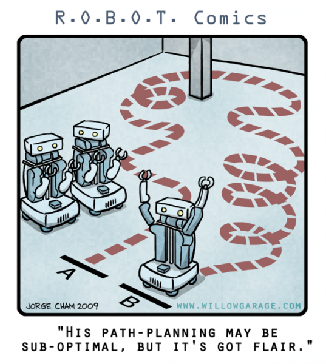
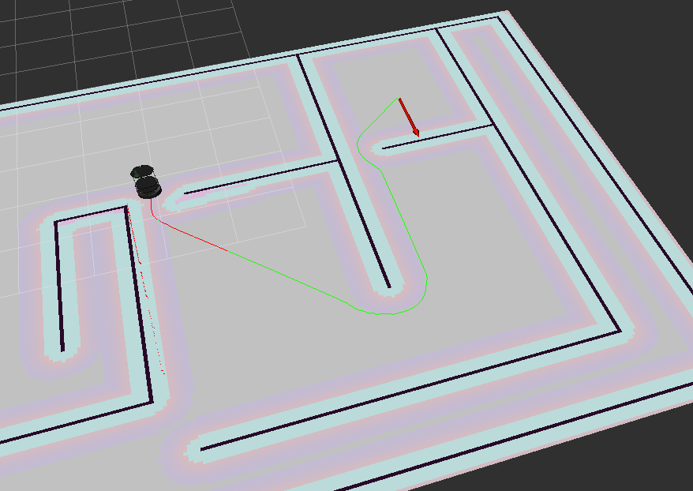
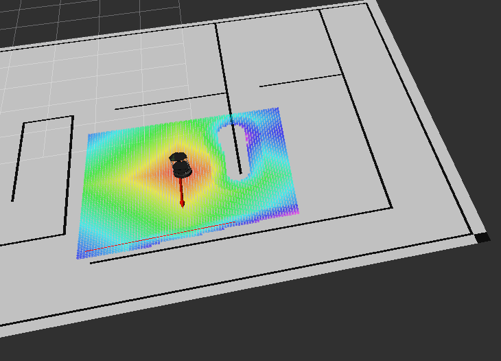
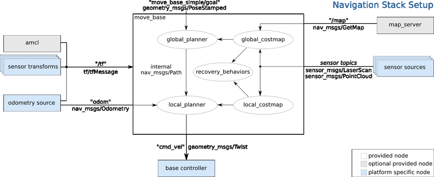
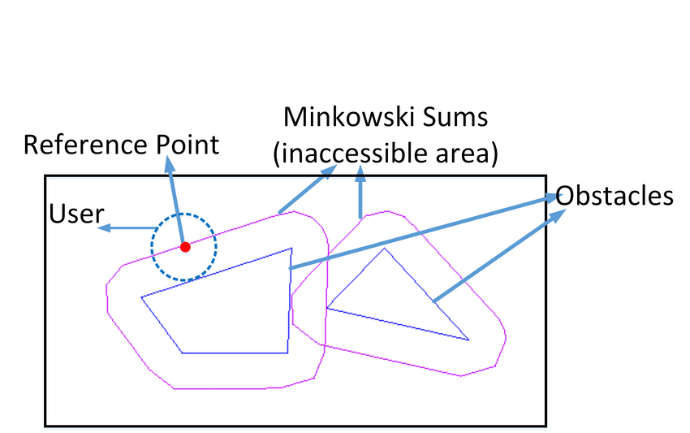
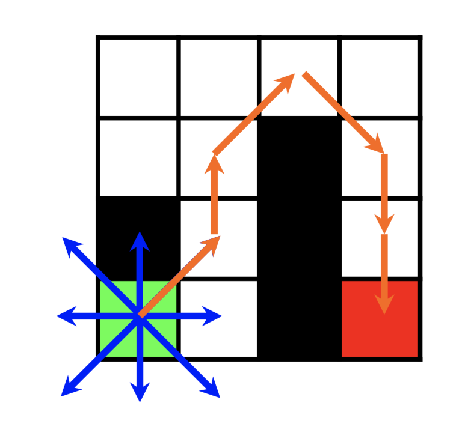
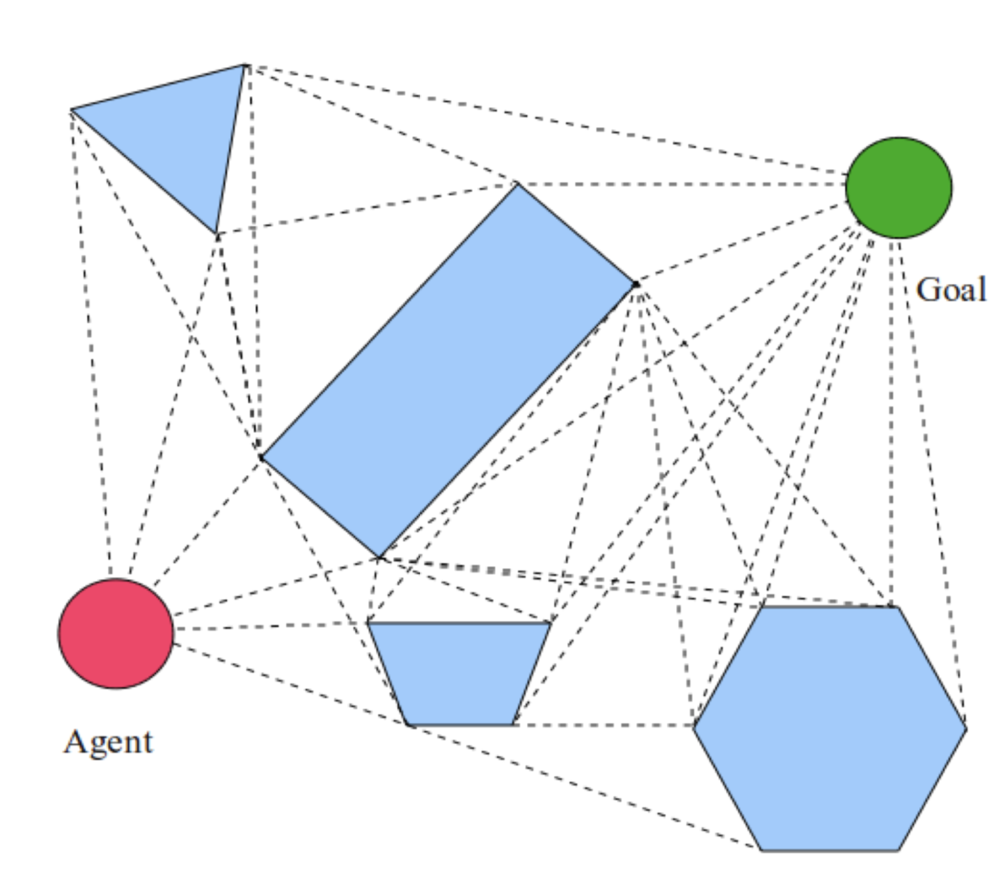
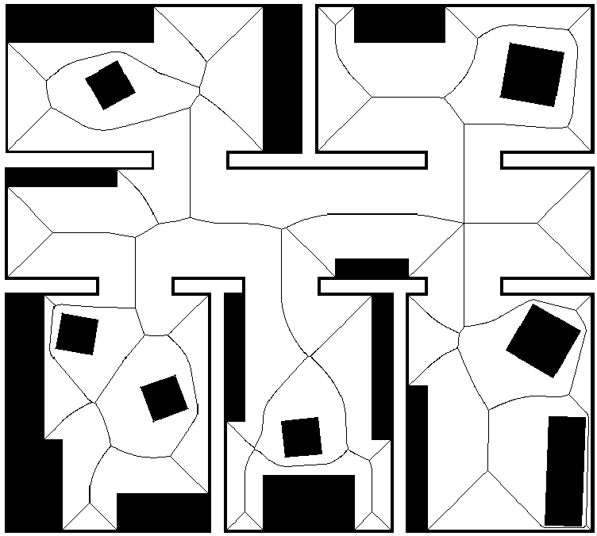
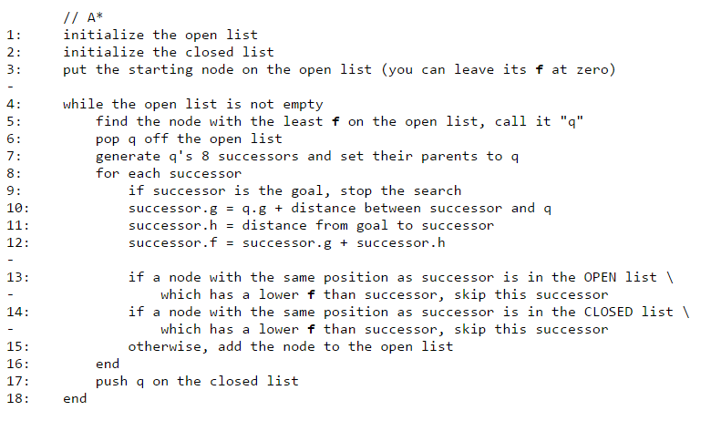
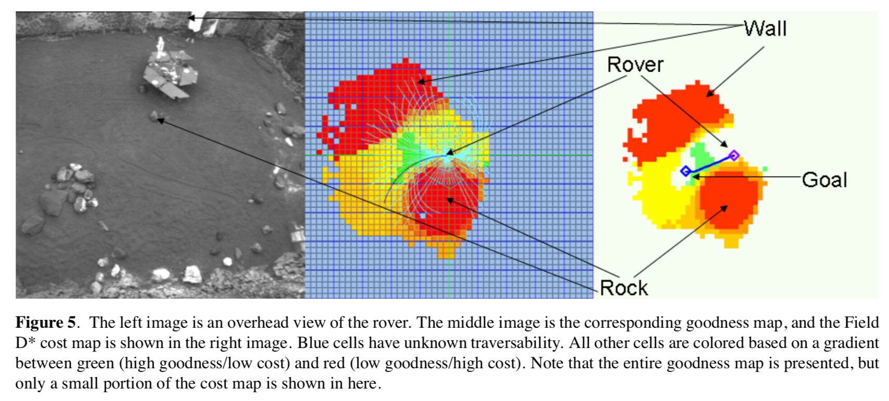

<!-- .slide: class="titulo" -->

# Robots móviles <!-- .element: class="column half" -->

## Tema 6. Navegación.
## Parte I: Planificación de trayectorias <!-- .element: class="column half" -->

---

<!-- .slide: class="titulo" -->

# Navegación  <!-- .element: class="column half" -->

## Introducción: ¿qué es navegar? <!-- .element: class="column half" -->

---

## Navegación

Conjunto de técnicas y algoritmos necesarios para que un robot móvil pueda llegar hasta su destino por el **camino más corto** posible y **sin chocar con los obstáculos**

 <!-- .element: class="stretch" -->

---

## Global vs local

- **Navegación global**: encontrar el camino óptimo (más corto o más adecuado) Necesitaremos:
    +  Un **mapa**
    +  Un algoritmo para el **cálculo del camino** óptimo según el mapa
- **Navegación local**: no chocar con obstáculos no reflejados en el mapa. Necesitaremos:
    + Información de los **sensores de rango**
    + Un algoritmo de **evitación de obstáculos**, que calcule la mejor dirección de movimiento para evitarlos (sin alejarnos demasiado del camino óptimo)

---

## ROS: navegación global (izq.) y local (der.)

Se muestra el *costmap* global y el cálculo del camino,  y el *costmap* local

 <!-- .element: class="column half" -->
 <!-- .element: class="column half" -->

Notas:

En ROS se discretiza el espacio en una rejilla y se crea un *costmap* local y uno global, al estilo de las rejillas de ocupación. En cada celda de este "mapa" se almacena el "coste" que tiene para el robot pasar por ella. Costes altos indican que el robot no debería pasar por ahí. 

En el *costmap* global los costes altos están en las zonas ocupadas del mapa y alrededor de ellas, ya que el robot no solo debe evitar chocar contra la pared, además no debe acercarse demasiado, ya que al haber una incertidumbre en la localización podría chocar. 

El *costmap* local se actualiza con la información de los sensores de rango. En este último los colores cálidos indican una zona apropiada para moverse (coste bajo) y los fríos una zona a evitar (coste alto).

---

## El *stack* de navegación en ROS

 <!-- .element: class="stretch" -->

---

<!-- .slide: class="titulo" -->

# Planificación global  <!-- .element: class="column half" -->

## Cálculo del camino más corto. Algoritmos deterministas <!-- .element: class="column half" -->

---

La gran mayoría de algoritmos de cálculo de rutas trabajan en el **espacio de configuraciones** o CSpace: el espacio formado por las posibles poses del robot

- Tantas dimensiones como grados de libertad tenga el robot
- Buscamos una ruta en este espacio que solo pase por espacio libre

Es un concepto habitual en planificación de movimiento de brazos robot ([Demo](https://www.cs.unc.edu/~jeffi/c-space/robot.xhtml))

---

## CSpace para robots móviles

Típicamente la *pose* se define con $(x,y,\theta)$, lo que daría un CSpace 3D. 

No obstante, vamos a hacer simplificaciones:

- **Ignoraremos la ~$\theta$~**  (el CSpace se queda en 2D). Esto podemos hacerlo si el robot es *holonómico*, es decir puede seguir cualquier trayectoria en el CSpace.
- Podemos suponer que **el robot es un punto**, si **"dilatamos" los obstáculos** al menos en un tamaño igual al radio del robot

---

La operación de dilatación que necesitamos ha sido formalizada en diferentes campos de las matemáticas:
- *Suma de Minkowski* de la forma del robot y los obstáculos 
- En *morfología matemática* la operación se denomina también [*dilatación*](https://es.wikipedia.org/wiki/Morfolog%C3%ADa_matemática#Dilatación)

 <!-- .element: class="stretch" -->

---

En ROS se aplica la misma idea, generando un *costmap* llamado *inflation costmap*

 <!-- .element: class="stretch" -->

---

 <!-- .element: class="stretch" -->

---

## Búsqueda del camino más corto

Hay infinitos caminos posibles entre un origen y un destino, pero el espacio de búsqueda no puede ser infinito, hay que *restringirlo*. Normalmente:

1. Transformar el CSpace en un grafo que contenga todos los caminos a considerar.
2. Aplicar algún algoritmo de búsqueda de camino más corto en grafos.

---

## Conversión del CSpace en un grafo

Dependerá de la representación del mapa:

- *Mapas poligonales*: varias formas, por ejemplo:
    + Grafo de visibilidad
    + Grafo de voronoi
- *Rejillas de ocupación*: cada celda será un nodo, conectado con sus 8 vecinos más inmediatos. 

 <!-- .element: class="stretch" -->

---

## Grafo de visibilidad

Grafo cuyos nodos son los vértices de los polígonos, y los arcos las conexiones entre ellos que no intersectan ningún obstáculo.

Tomado de <a href="https://www.slideshare.net/GauravGupta527/visibility-graphs">https://www.slideshare.net/GauravGupta527/visibility-graphs</a>

 <!-- .element: class="stretch" -->

---

## Diagramas de Voronoi

Formado maximizando la distancia mínima a los obstáculos (todos los puntos con la misma distancia mínima a dos o más objetos)

 <!-- .element: class="stretch" -->

- No nos va a dar los caminos más cortos
- Al maximizar la distancia a los objetos, maximizamos la seguridad 

---

## Algoritmos de búsqueda de camino más corto

- Algoritmos clásicos de búsqueda en grafos: el más típico es **Dijkstra**
- Guiados por heurísticas: el más usado es `A*`, aunque hay otros similares, como `D*`
- Curiosidad: A* surgió de la investigación realizada con el robot **Shakey**

---

## A*

- La búsqueda se guía por un $f(n)$ para cada nodo: $f(n) = g(n) + h(n)$, siempre expandimos por el nodo de menor $f(n)$
    + $g(n)$: coste del camino ya recorrido
    + $h(n)$ una heurística *admisible* (== una estimación "optimista") para el camino que queda

Demo: [http://qiao.github.io/PathFinding.js/visual/](http://qiao.github.io/PathFinding.js/visual/)

Notas:

Tanto A* como Dijkstra son óptimos en el sentido de que van a encontrar el camino más corto, aunque en el caso de A* la heurística debe ser lo que se denomina *admisible*. Para que una heurística sea admisible no debe nunca  *sobreestimar* el coste real del camino.

A* tiene la ventaja de que *en promedio* es más eficiente que Dijkstra. Será más eficiente cuanto mejor sea la heurística (cuanto más se aproxime al coste real del camino que queda, sin pasarse).

---

## Pseudocódigo A*

 <!-- .element: class="stretch" -->

---

## Otros algoritmos: D* y D* lite

- Similares a A*, aunque parten del destino en lugar del origen
- Pueden *replanificar* trayectorias: pueden "reparar" la trayectoria de modo incremental si hay cambios en el grafo 

---

- Los *rover* de Marte necesitan autonomía dado el retardo de la señal Tierra-Marte (entre 3-22 min) 
- Usan un mapa de costes de rejilla y una versión modificada del algoritmo `D*` para calcular el camino más corto. 

 <!-- .element: class="stretch" -->

---

## Búsqueda del camino más corto en ROS

- Paquete [`global_planner`](http://wiki.ros.org/global_planner), implementa Dijkstra y A*. 
- Se puede seleccionar el algoritmo con el parámetro booleano `use_dijkstra`. `true`=Dijkstra, `false`=A* (`true` por defecto)

---

<!-- .slide: class="titulo" -->

# Planificación global  <!-- .element: class="column half" -->

## Cálculo del camino más corto. Algoritmos probabilísticos <!-- .element: class="column half" -->

---

## Algoritmos probabilísticos

- Muestrean aleatoriamente el conjunto de caminos posibles

- Apropiados cuando el espacio de búsqueda es muy grande, por ejemplo  porque
    + Tiene más dimensiones (por ejemplo un dron o un robot no circular)
    + La trayectoria a calcular es muy larga

---

## Probabilistic Roadmap Method (PRM)

**Fase de procesamiento**
1. Generar nodos al azar en el espacio libre
2. Conectar cada nodo con los vecinos si el camino no colisiona con obstáculos

**Fase de consulta**

Calcular el camino más corto en el grafo mediante algún algoritmo de búsqueda

  

    
Seleccionando distintos nodos de comienzo y fin podemos reutilizar el grafo

---

## Rapidly-exploring Random Tree (RRT)

Vamos formando un árbol que va “creciendo” desde el origen hasta el destino

 <!-- .element: class="column two-thirds" -->

 <!-- .element: class="column third" -->

---

## Por qué funcionan los RRT

Se puede demostrar que si el muestreo del espacio es uniforme, los nodos que se van a expandir con mayor probabilidad son los de la frontera del árbol *(técnicamente hablando, la probabilidad es proporcional al área de la región de Voronoi del punto)*. ([demo para calcular áreas de voronoi](http://alexbeutel.com/webgl/voronoi.html))

